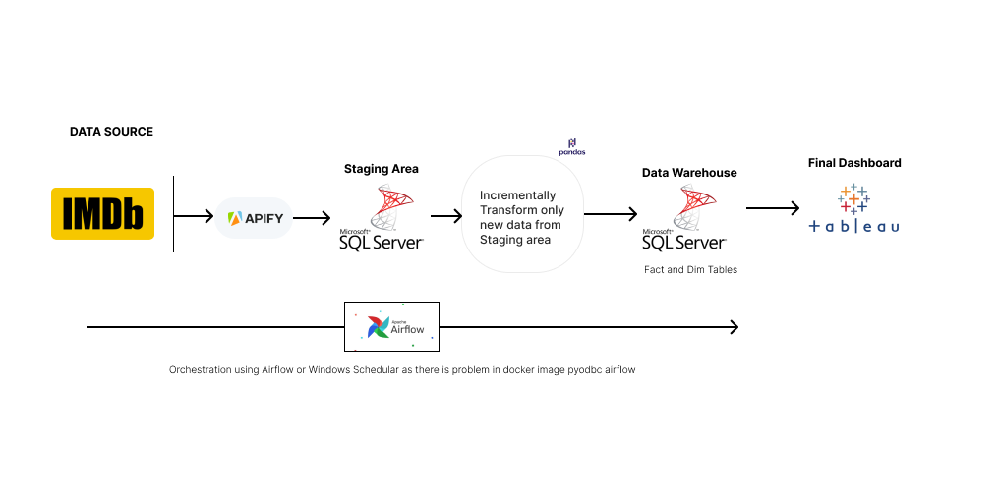
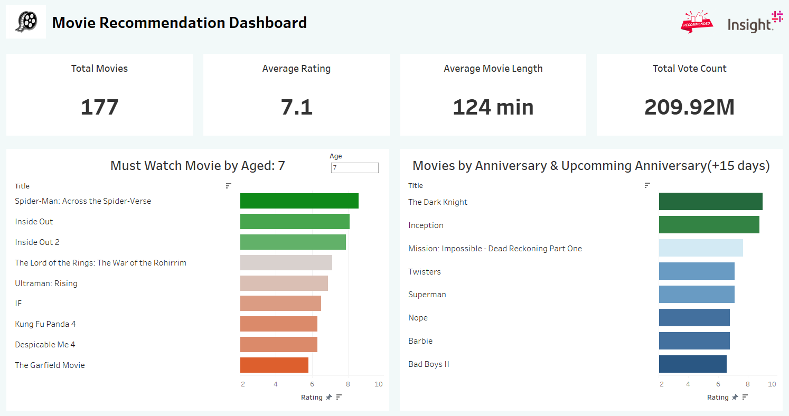
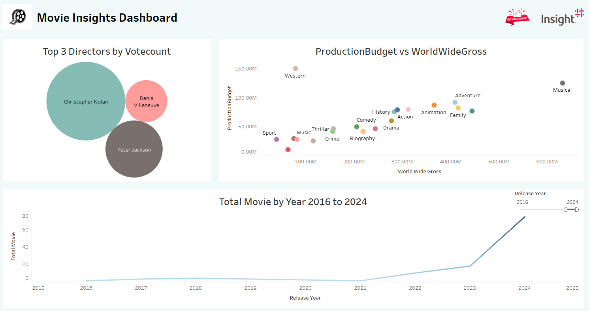

### IMDB DATA PIPELINE AND MOVIE RECOMMENDATION IN TABLEAU

##### Architecture

    

#### Dashboard View

##### Page 1: Recommendation

    

##### Page 2: Additional Insights

    

### HOW TO USE:

1. create virtual env

   python -m venv venv

2. Install dependencies inside venv

   activate venv first
   pip install -r requirements.txt

3. HOW TO RUN ?

   python main.py

   This will run entire pipeline and data will be stored into your warehouse i.e sql server

4. Additional Information
   I have kept the logic of upsert and dynamically selecing rows from staging area inorder to perform transformation on only those which are new to minimize cost of computation and entire cost.
